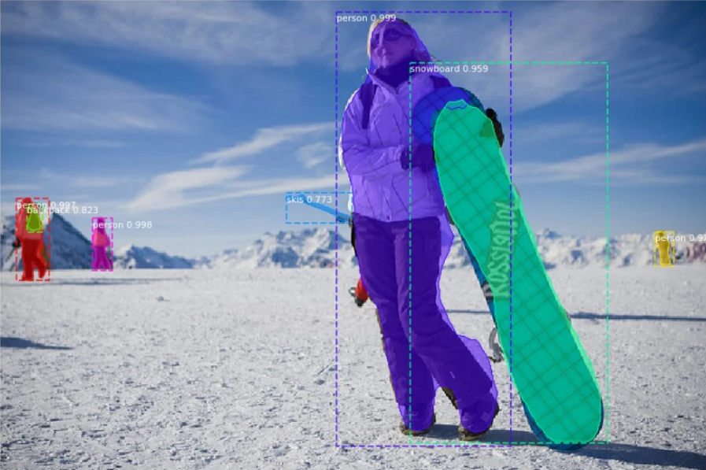

# Image Segmentation using Mask R-CNN

This project demonstrates image segmentation using the Mask R-CNN model.

## Setup

1. **Clone the repository**:
    ```bash
    git clonec https://github.com/matterport/Mask_RCNN.git
    cd Mask_RCNN
    ```

2. **Install dependencies**:
    ```bash
    pip install -r requirements.txt
    ```

3. **Download pre-trained weights**:
    ```bash
    wget https://github.com/matterport/Mask_RCNN/releases
    ```

## Usage

1. **Run the Jupyter Notebook**:
    ```bash
    jupyter notebook Image_segmentation.ipynb
    ```

2. **Configuration**:
    - Set up the environment and import necessary libraries.
    - Configure the Mask R-CNN model for inference.
    - Load pre-trained weights for the COCO dataset.
    - Define class names for the COCO dataset.

3. **Visualization**:
    - Visualize the model's predictions on sample images.

## Results

The notebook demonstrates how to use Mask R-CNN for image segmentation, including loading pre-trained weights and visualizing predictions.



## References

- Mask R-CNN paper
- COCO dataset
